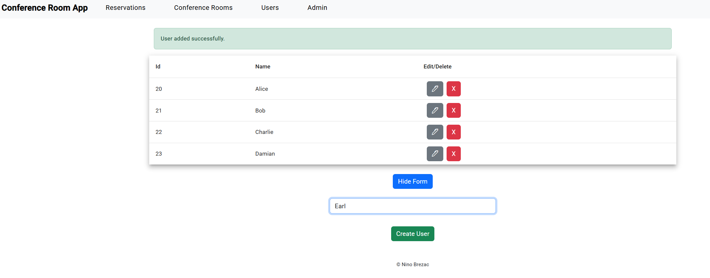
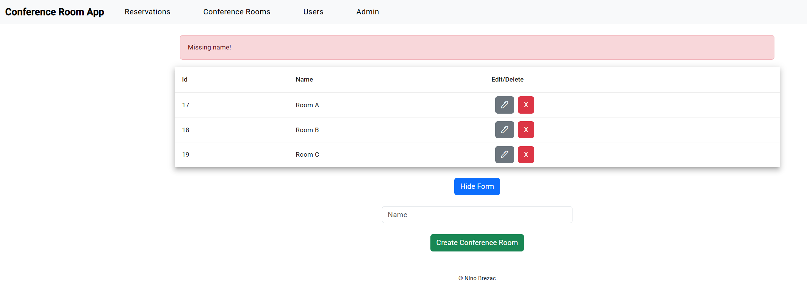
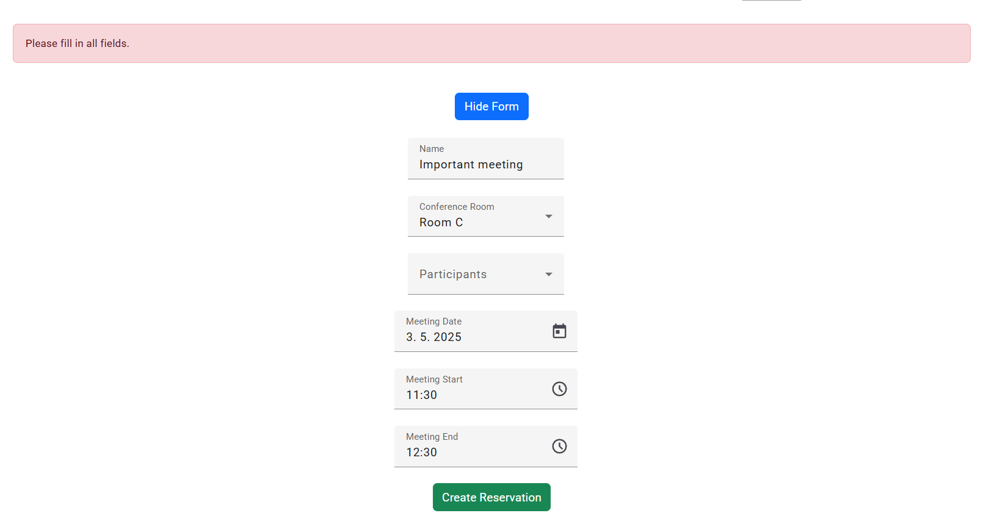
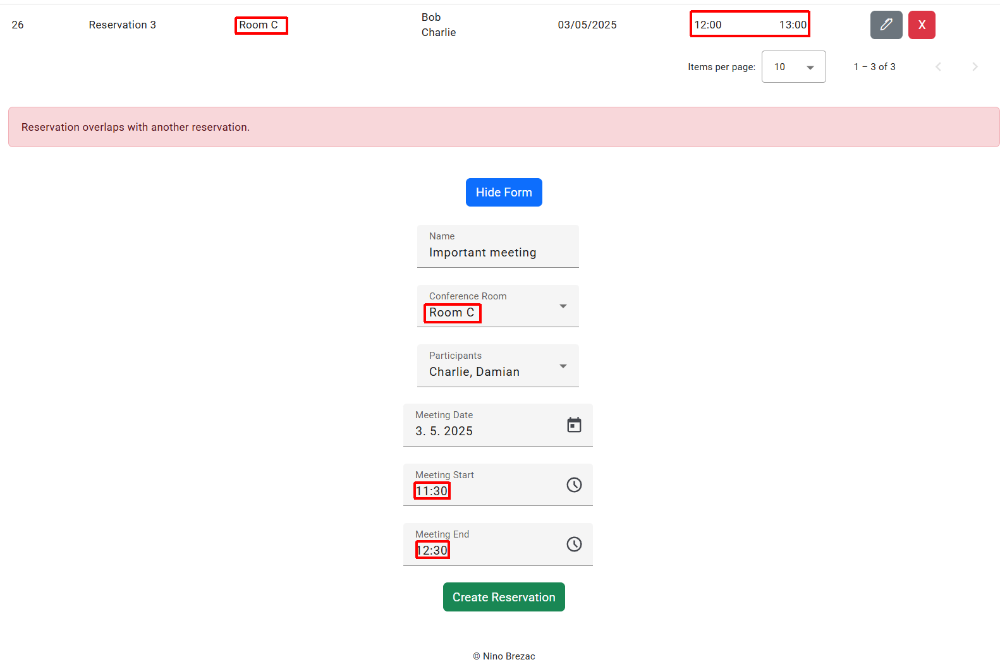
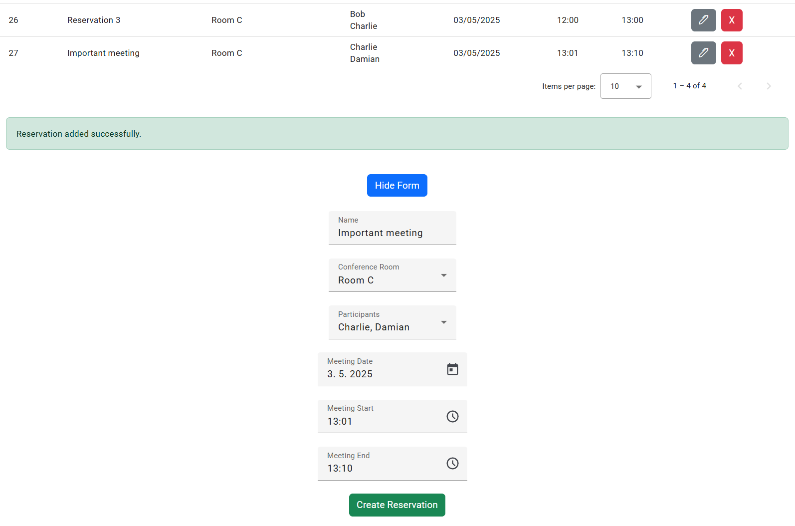

# ConferenceRoomApp

A simple SPA made utilizing:
- Angular for the FE (+ some other libraries, such as Angular Material for tables and inputs)
- Node (Express) for the API
- Prisma for handling DB work
- an SQLite relational DB

The app allows adding, editing, deleting and viewing users, conference rooms and the reservation of said rooms.

Users can create conference room reservations, select the conference room they take place at, select their participants and their time of start and end. Reservations can not be made for the past, and every conference room reservation must not overlap with other reservations in the same conference room.

Users need a name longer than 3 characters, conference rooms need just a name.
Reservations need a name, a conference room, participants (1 or more), a time of start and end (date is the same).

## Structure

The Angular frontend runs on http://localhost:4200 by default, while the REST API is available on http://localhost:3000 with the following routes:

`GET`, `POST`:
- http://localhost:3000/users
- http://localhost:3000/conference-rooms
- http://localhost:3000/reservations

`GET`, `DELETE`, `PUT`:
- http://localhost:3000/users/:id
- http://localhost:3000/conference-rooms/:id
- http://localhost:3000/reservations/:id

`POST`, `DELETE`:
- http://localhost:3000//admin/seed-data
- http://localhost:3000//admin/clear-data

**OpenAPI documentation** is displayed via Swagger UI on http://localhost:3000/docs. Here you can test API calls, see the schema and examples, expected values etc.
The documentation is enabled by default by running the API itself with `node server.js`.

## Setup

Make sure you have at least Node v18.13.
Ensure that ports 3000 (for the API) and 4200 (for Angular) are not in use by other applications. 
Alternatively change the API URL in ```server.js```, and ```database.service.ts```

First terminal:
```bash
git clone https://github.com/phantomchicken/Conference-Room-App/
cd Conference-Room-App
npm install
cd api
npm install

# Either manually create an .env file with DATABASE_URL="file:./prisma/prisma/dev.db" and save it with UTF-8 encoding, or run these two commands
echo DATABASE_URL="'file:./prisma/prisma/dev.db'" > .env
Set-Content .env 'DATABASE_URL="file:./prisma/dev.db"' -Encoding UTF8

npx prisma generate
npx prisma migrate dev
node seed.js
node server.js
```

Second terminal:
```bash
cd Conference-Room-App

# Alternatively skip the global installation of Angular CLI and prefix every ng command with npx e.g. npx ng serve
npm install -g @angular/cli 
ng serve --open
```

The app is now running on http://localhost:4200, and the API is running on http://localhost:3000.
The database can be quickly cleared and reseeded by visiting http://localhost:4200/admin and clicking the appropriate button (add/clear).

## Testing

Two simple mock unit tests were made. They test the functionalities of adding users and conference rooms. They are run by executing the following command from the root folder:
```bash
ng test --no-watch
```

## Examples


Adding users


Unsuccessful conference room creation.


Unsuccessful reservation creation.


Unsuccessful reservation creation, due to overlapping with an existing reservation in the same conference room.


Successful reservation creation.
